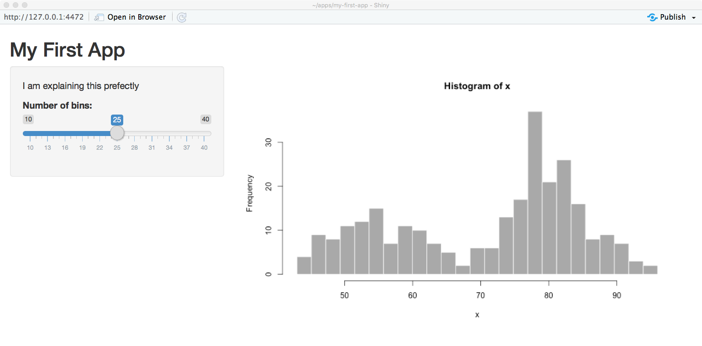

In this tutorial, I'm going to walk you through the absolute basics of setting up a shiny app, starting with the example built into RStudio. I'm not going to explain yet how shiny apps are structured, the goal is to just get something up and running, and give you some familiarity with the layout of a fairly simple app.

* Knowledge: [Basic RStudio and R](https://gupsych.github.io/data_skills/01_intro.html)
* Programs: [R](http://cran.r-project.org/mirrors.html) and [RStudio](https://www.rstudio.com/products/rstudio/download3/)
* Packages: `shiny`, `ggplot2`
* Time: ~ 20 minutes

# Create the Demo App

<input type="checkbox" class="progress">

##  New project...

Under the `File` menu, choose `New Project...`. You will see a popup window like the one below. Choose `New Directory`.


<input type="checkbox" class="progress">

## Project type
Choose `Shiny Web Application` as the project type.


<input type="checkbox" class="progress">

## Directory name
I like to put all of my apps in the same directory, but it doesn't matter where you save it.


<input type="checkbox" class="progress">

## Default demo app

Your RStudio interface should look like this now. You don't have to do anything else at this step.


<p class="alert alert-warning">If RStudio has changed their demo app and your source code doesn't look like this, replace it with the code below:</p>

```{r demo-rstudio, eval = F}
#
# This is a Shiny web application. You can run the application by clicking
# the 'Run App' button above.
#
# Find out more about building applications with Shiny here:
#
#    http://shiny.rstudio.com/
#

library(shiny)

# Define UI for application that draws a histogram
ui <- fluidPage(
   
   # Application title
   titlePanel("Old Faithful Geyser Data"),
   
   # Sidebar with a slider input for number of bins 
   sidebarLayout(
      sidebarPanel(
         sliderInput("bins",
                     "Number of bins:",
                     min = 1,
                     max = 50,
                     value = 30)
      ),
      
      # Show a plot of the generated distribution
      mainPanel(
         plotOutput("distPlot")
      )
   )
)

# Define server logic required to draw a histogram
server <- function(input, output) {
   
   output$distPlot <- renderPlot({
      # generate bins based on input$bins from ui.R
      x    <- faithful[, 2] 
      bins <- seq(min(x), max(x), length.out = input$bins + 1)
      
      # draw the histogram with the specified number of bins
      hist(x, breaks = bins, col = 'darkgray', border = 'white')
   })
}

# Run the application 
shinyApp(ui = ui, server = server)

```

<input type="checkbox" class="progress">

## Run the app

Click on `Run App` in the top right corner of the [source pane](defs.html#panes). The app will open up in a new window. Play with the slider and watch the histogram change.


<p class="alert alert-info">You can also open up the app in a web browser by clicking on `Open in Browser`.</p>

# Modify the Demo App

Now we're going to make a series of changes to the demo app until it's all your own.

<p class="alert alert-info">You can close the app by closing the window or browser tab it's running in, or leave it running while you edit the code. If you have multiple screens, it's useful to have the app open on one screen and the code on another.</p>

<input type="checkbox" class="progress">

## Change the title

Find the application title. It is the first [argument](defs.html#argument) to the [function](defs.html#function) `titlePanel`. Change the title to `"My First App"`. Make sure the title is inside quotes and the whole quoted [string](defs.html#string) is inside the parentheses. Save the file (`cmd-S` or `File > Save`).


<input type="checkbox" class="progress">

## Reload the app

Click `Run App` (or `Reload App` if you haven't closed the app window) in the [source pane](defs.html#panes). If you haven't saved your changes, it will prompt you to do so. Check that the app title has changed.

<input type="checkbox" class="progress">

## Change the input

Find the function `sliderInput` (line 21). The first [argument](defs.html#argument) is the name you can use in the code to find the value of this input, so don't change it just yet. The second argument is the text that displays before the slider. Change this to something else and re-run the app.

```{r, app-sliderInput, eval = F}
         sliderInput("bins",
                     "Number of bins:",
                     min = 0,
                     max = 50,
                     value = 30)
```

<p class="alert alert-tryit">See if you can figure out what the next three arguments to `sliderInput` do. Change them to different integers, then re-run the app to see what's changed.</p>

<input type="checkbox" class="progress">

## Add some text

The arguments to the function `sidebarPanel` are just a list of things you want to display in the sidebar. To add some explanatory text in a paragraph before the `sliderInput`, just use the paragraph function `p("My text")`

```{r, app-sidebar-p, eval = F}
      sidebarPanel(
         p("I am explaining this perfectly"),
         sliderInput("bins",
                     "Choose the best bin number:",
                     min = 10,
                     max = 40,
                     value = 25)
      )
```



<p class="alert alert-info">The sidebar shows up on the left if your window is wide enough, but moves to the top of the screen if it's too narrow.</p>

<input type="checkbox" class="progress">

## Move the text

I don't like it there, so we can move this text out of the sidebar and to the top of the page, just under the title. Try this and re-run the app.

```{r, app-intro-text, eval = F}
   # Application title
   titlePanel("My First App"),

   p("I am explaining this perfectly"),

   # Sidebar with a slider input for number of bins
   sidebarLayout(...)
```

<p class="alert alert-tryit">See where you can move the text in the layout of the page and where causes errors.</p>

<input type="checkbox" class="progress">

## Change the plot colour

I'm also not keen on the grey plot. We can change it inside the `hist` function.

```{r plot-colors, eval = F}
      # draw the histogram with the specified number of bins
      hist(x, breaks = bins, col = 'steelblue3', border = 'grey30')
```

There are a lot of ways to represent colour in R. The easiest three are:

1. hexadecimal colours like `#0066CC`, 
2. the `rgb` or `hsl` functions, 
3. colour names (see page 4 of Melanie Frazier's [R color cheetsheet](https://www.nceas.ucsb.edu/~frazier/RSpatialGuides/colorPaletteCheatsheet.pdf)

I like `steelblue3`, as it's pretty close to the shiny intereface default colour, but feel free to choose whetever you like. 

<input type="checkbox" class="progress">

## Change the plot style

I prefer `ggplot` graphs, so let's make the plot with `geom_histogram` instead of `hist` (which is a great function for really quick plots). Since we need several functions from the `ggplot` [package](defs.html#package), we'll need to load that package at the top of the script, just under where the `shiny` package is loaded:

```{r load-library, eval = F}
library(shiny)
library(ggplot2)
```

You can replace all of the code in the `renderPlot` function with the code below. 

```{r, ggplot, eval = F}
  output$distPlot <- renderPlot({
    # create plot
    ggplot(faithful, aes(waiting)) +
      geom_histogram(bins = input$bins,
                     fill = "steelblue3",
                     colour = "grey30") +
      xlab("What are we even plotting here?") +
      theme_minimal()
  })
```

<p class="alert alert-info">You can set the `fill` and `colour` to whatever colours you like, and change `theme_minimal()` to one of the other [built-in ggplot themes](https://ggplot2.tidyverse.org/reference/ggtheme.html#examples).</p>

<p class="alert alert-tryit">What *are* we even plotting here? Type `?faithful` into the console pane to see what the `waiting` column represents (`faithful` is a built-in demo dataset). Change the label on the x-axis to something more sensible.</p>

# Adding New Things

<input type="checkbox" class="progress">

## Add a new input widget

The `faithful` dataset includes two columns:`eruptions` and `waiting`. We've been plotting the `waiting` variable, but what if you wanted to plot the `eruptions` variable instead? 

<p class="alert alert-tryit">Try plotting the eruption time (`eruptions`) instead of the waiting time. You just have to change one word in the `ggplot` function and update the x-axis label.</p>

We can add another input widget to let the user switch between plotting eruption time and wait time. The [RStudio Shiny tutorial](https://shiny.rstudio.com/tutorial/written-tutorial/lesson3/) has a great overview of the different input options. We need to toggle between two otions, so we can use either radio buttons or a select box. Radio buttons are probably best if you have only a few options and the user will want to see them all at the same time to decide.

Add the following code as the first argument to `sidebarPanel()`, which just takes a list of different [widgets](defs.html#widget). `radioButtons` is the widget we're using. The first argument is `display_var`, which we will use later in the code to find the value of this widget. The second argument is the label to display to the user. The next argument is `choices`, which is a list of choices in the format `c("label1" = "value1", "label2 = "value2", ...)`. The label is what gets shown to the user and the value is what gets used by the code (these can be the same, but you often want the user label to be more descriptive). The last argument is `selected`, which is the value of the default choice. Save this and re-run the app.

```{r add-radiobuttons, eval = F}
         radioButtons("display_var",
                      "Which variable to display",
                      choices = c("Waiting time to next eruption" = "waiting",
                                  "Eruption time" = "eruptions"),
                      selected = "waiting"
         ),
```


You should have a radio button interface now. You can click on the options to switch the button, but it won't do anything to your plot yet. We need to edit the plot-generating code to make that happen. 


<input type="checkbox" class="progress">

## Change what you're plotting

First, we need to change the x-axis label depending on what we're graphing. We use an if/else statement to set the variable `xlabel` to one thing if `input$display_var` is equivalent to `"eruptions"`, and to something else if it's equivalent to `"waiting"`. Put this code at the very beginning of the code block for the `renderPlot` function (after the line `output$distPlot <- renderPlot({`).

```{r plot-switch1, eval = F}
      # set x-axis label depending on the value of display_var
      if (input$display_var == "eruptions") {
        xlabel <- "Waiting Time to Next Eruption (in minutes)"
      } else if (input$display_var == "waiting") {
        xlabel <- "Waiting Time to Next Eruption (in minutes)"
      }
```

<p class="alert alert-warning">The double-equal-signs `==` means "equivalent to and is how you check if two things are the same; if you only use one equal sign, you set the variable on the left to the value on the right.</p>

Then we have to edit the `ggplot` function to use the new label and to plot the right column. Notice that the function `aes(waiting)` from before has changed to `aes_string(input$display_var)`. The variable `input$display_var` gives you the user-input value of the widget called `display_var`. 

```{r plot-switch2, eval = F}
      # create plot
      ggplot(faithful, aes_string(input$display_var)) +
        geom_histogram(bins = input$bins,
                       fill = "steelblue3",
                       colour = "grey30") +
        xlab(xlabel) +
        theme_minimal()
```

<p class="alert alert-warning">The change from `aes` to `aes_string` is a quirk of `ggplot`; if you need to use [strings](defs.html#string) to specify the names of the columns to display, you have to use `aes_string`. The value of `display_var` is a string, so we have to do it this way.</p>

Re-run your app and see if you can change the data and x-axis label with your new widget. If not, check that your code against the code below:

```{r example-code, eval = F}
#
# This is a Shiny web application. You can run the application by clicking
# the 'Run App' button above.
#
# Find out more about building applications with Shiny here:
#
#    http://shiny.rstudio.com/
#

library(shiny)
library(ggplot2)

# Define UI for application that draws a histogram
ui <- fluidPage(

   # Application title
   titlePanel("My First App"),

   p("I am explaining this perfectly"),

   # Sidebar with a slider input for number of bins
   sidebarLayout(
      sidebarPanel(
         radioButtons("display_var",
                      "Which variable to display",
                      choices = c("Waiting time to next eruption" = "waiting",
                                  "Eruption time" = "eruptions"),
                      selected = "waiting"
         ),
         sliderInput("bins",
                     "Number of bins:",
                     min = 10,
                     max = 40,
                     value = 25)
      ),

      # Show a plot of the generated distribution
      mainPanel(
         plotOutput("distPlot")
      )
   )
)

# Define server logic required to draw a histogram
server <- function(input, output) {

    output$distPlot <- renderPlot({
      # set x-axis label depending on the value of display_var
      if (input$display_var == "eruptions") {
        xlabel <- "Waiting Time to Next Eruption (in minutes)"
      } else if (input$display_var == "waiting") {
        xlabel <- "Waiting Time to Next Eruption (in minutes)"
      }

      # create plot
      ggplot(faithful, aes_string(input$display_var)) +
        geom_histogram(bins = input$bins,
                       fill = "steelblue3",
                       colour = "grey30") +
        xlab(xlabel) +
        theme_minimal()
    })
}

# Run the application
shinyApp(ui = ui, server = server)

```

