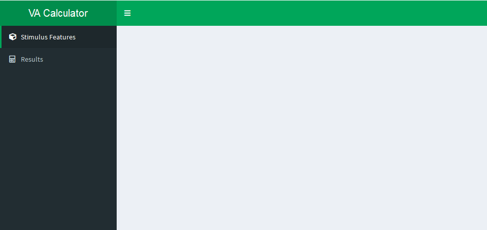

This tutorial will show you how Shiny can also be used to build handy apps which can be used in research and teaching. As an example, we will be building an app which will help us calculate the [visual angle](https://en.wikipedia.org/wiki/Visual_angle) of a stimulus. I'd recommend you complete the earlier Shiny tutorials ([Creating your first app](01-first-app.html) and [Data collection](data-input.html)) as we'll be building on that knowledge here.

This tutorial will also introduce [reactivity](https://shiny.rstudio.com/articles/understanding-reactivity.html), which refers to how the app will react to the user's input, and [shinydashboard](https://rstudio.github.io/shinydashboard/), a [package](defs.html#package) which lets us build much more visually pleasing and user-friendly Shiny apps.

# Try the Demo App

Try the simple [Visual Angle app](http://shiny.psy.gla.ac.uk/JackTaylor/VisualAngle/). You'll have something very similar built by the end of this tutorial.

# Setup

## Install `shinydashboard`

This tutorial uses `shinydashboard`. If you've not already done so, install the latest version of `shinydashboard` with:

```{r, eval=F}
install.packages("shinydashboard")
```

## New Shiny Project

Create a new Shiny Web Application project, and name it something like, "Visual-Angle-Calculator". For a reminder of how to do this, have a look at [the Creating your First App](01-first-app.html) tutorial.

## Replace the default code

[As in the first tutorial](01-first-app.html#14_default_demo_app), this will display the code for the default demo app. Delete all of the default code, and replace it with the following:

```{r, eval = F}
library(shiny)
library(shinydashboard)
library(tidyverse)

# function for calculating visual angle
get_va <- function(size, distance, approx=F){
  if (approx) {
    rad <- atan(size/distance)
  } else {
    rad <- 2*atan(size/(2*distance))
  }
  rad*(180/pi)  # radians to angle
}
# function for converting to consistent units (mm)
to_mm <- function(val, units){
  recode(
    units,
    "mm"=as.double(val),
    "cm"=as.double(val)*10,
    "inches"=as.double(val)*25.4
  )
}


ui <- dashboardPage(
  
  skin = "purple",
  
  dashboardHeader(),
  
  dashboardSidebar(),
  
  dashboardBody()
  
)

server <- function(input, output) {
  
  
  
}

shinyApp(ui = ui, server = server)
```

## Run the App

Click on Run App in the top right corner of the [source pane](defs.html#panes), or enter `shiny::runApp()` in the console. You'll notice that so far we just have an empty app.

# Building the UI - Basics

The `shinydashboard` [UI](defs.html#ui) consists of three main parts, given as arguments to the `dashboardPage()` function:

* the header, `dashboardHeader()`

* the sidebar, `dashboardSidebar()`

* the main body, `dashboardBody()`

## Choose a Skin

We'll start by choosing a skin for the app. In the `dashboardPage()` function, change `skin = "purple"` to a colour of your choice. To see all the available skin colours, see the [`shinydashboard` documentation](https://rstudio.github.io/shinydashboard/appearance.html). Run the app to see how this affects the app's appearance.

## Choose a Title

Next we'll choose a title for the app. In the `dashboardHeader()` function, enter `title = "My App Title"`. Run the app to see how this affects the app's appearance. Your title may be too long to display, in which case, [see here](https://rstudio.github.io/shinydashboard/appearance.html#long-titles).

## Build the Sidebar

### Copy and Paste

Change the `dashboardSidebar()` function to include the `sidebarMenu()` argument like so:

```{r, eval=F}
dashboardSidebar(
  sidebarMenu(
    menuItem("Process Cats", tabName="felinetab", icon=icon("cat")),
    menuItem("Process Frogs", tabName="amphibiantab", icon=icon("frog"))
  )
)
```

Run the app to see how this affects the app's appearance.

The `sidebarMenu()` function tells`shinydashboard` to render a menu in the sidebar. Each `menuItem()` function then adds an item to that menu with desired text, name, and icon.

* The text is what the option will be displayed as to the user.

* The `tabName` will be used as a reference when building separate tabs later on.

* The icon is selected using [FontAwesome](https://fontawesome.com/icons) names.

### Customise

* Change the menu items' text to read `"Stimulus Features"` and `"Results"` (Hint: so far the menu items are labelled `"Process Cats"` and `"Process Frogs"`, so replace this text with desired tab label).

* Change the `tabName`s to something appropriate, such as `"stim-features"` and `"results"`.

* Choose suitable icons for the menu options, such as `"cube"` and `"calculator"`. See [https://fontawesome.com/icons](https://fontawesome.com/icons) for a list of all available icon names.

# Building the UI - Body

By now your App should look something like this:



The next step is to build the body for our tabs.

## Tab Items

The content for different tabs is created using the `tabItems()` function. Each tab is then described using the `tabItem()` function, embedded *inside* `tabItems()`.

Change the `dashboardBody()` function to include the `tabItems` function, and describe the stimulus features tab like so:

```{r, eval=F}
dashboardBody(
  tabItems(
    tabItem(
      tabName = "stim-features",
      fluidRow(
        # the tab's content will go in here
      )
    )
  )
)
```

Note that the `tabItem()` function "knows" which tab you are referring to because of the `tabName` argument, so make sure this matches the tab name you gave the stimulus features tab (above).

New tabs are created by giving additional `tabItem()` functions as arguments to `tabItems()`.

## Boxes

A distinctive feature of `shinydashboard` is [`boxes`](https://rstudio.github.io/shinydashboard/structure.html#boxes). These are a really easy way of organising your content in Shiny Apps. We can create a box using the `box()` argument, and putting it inside the `fluidRow()` function for the stimulus features tab.

Replace the section of your code that reads, `# the tab's content will go in here`, with the following:

```{r, eval=F}
box(
  width = 6,
  title = "Stimulus Size",
  column(12, numericInput("size", "Size", value=3.2, min=0.01, step=0.01, width="100%")),
  height = 250
)
```

Your App's Stimulus Features tab should now look something like this:

![images/02-first-box.png]

## Box Content

(add selectInput for units selection)

## Adding New Boxes

(build the Stimulus Distance box using what you've learned so far)

## Adding New Tabs' Content

(build the Results Tab content, but use `infoBox()`)

# Server Logic

## Calculate Visual Angle

(using functions given at top of script)

## Display Results reactively

(replace the info box in the UI with `infoBoxOutput()`, and render the UI in the server function)

# Bonus Material

## Iterative UI Generation
