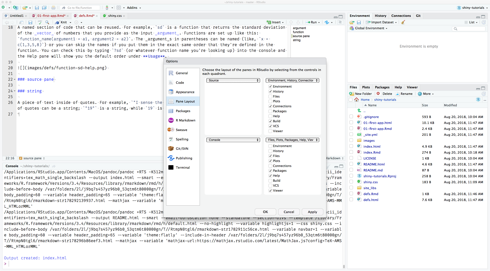

### argument

A variable that provides input to a [function](defs.html#function). 


### chunk

In an RMarkdown file (`.Rmd`), you can include a block (or "chunk") of R code by surrounding the code as in the example below:

<pre><code>```{r chunk-name}

mean_age <- mean(ages) %>% round(2)

&#96;&#96;&#96;</code></pre>

### comment

You can annotate `.R` files or [chunks](defs.html#chunk) in `.Rmd` files with comments by prefacing each line of the coment with one or more hash symbols (`#`).

```{r comment-demo}
# I'm demonstrating comments in this chunk
# This comment will be added to the document outline ----
```


Comments get added to the document outline if you put four or more dashes, equal signs, or hashes at the end. This is a great way to keep track of more complicated scripts.

### concatenate

When referring to strings, concatenate means to paste them together using the function `paste` (adds a space between strings) or `paste0` (doesn't add anything between strings). 

```{r concatenate-demo1}
subject_name <- "Lisa"
paste("Hello,", subject_name)
```


When referring to other types of variables, concatenate can mean to create a vector with those variables, usually using the `c` function. For example, you could concatenate the numbers 1, 3, 6, and 10 like this: `c(1, 3, 6, 10)`. You can concatenate two [vector](defs.html#vector)s as well:

```{r concatenate-demo2}
v1 <- 1:5
v2 <- 11:15
c(v1, v2)
```

<p class="alert alert-warning">Remember, a [vector](defs.html#vector) can only have one [data type](defs.html#data_type). So if you concatenate a [string](defs.html#string) vector and a [numeric](defs.html#numeric) vector, the numbers will get turned into their string versions. If you concatenate an [integer](defs.html#integer) and a [double](defs.html#integer) vector, the integers will be converted to doubles.</p>

```{r concatenate-demo3}
strings <- c("a", "c", "e")
integers <- c(1L, 3L, 5L)
doubles <- c(1.1, 3.3, 5.5)
c(strings, integers)
c(doubles, integers)
```

### data type

* [integer](defs.html#integer) (whole numbers like 1L, -10L, 3000L)
* double (numbers like -0.223, 10.324, 1e4)
* [string](defs.html#string)
* logical (`TRUE` or `FALSE`)

If you want to know what data type a variable is, use the function `typeof`.

```{r data-type-demo}
typeof(10)
typeof("10")
typeof(10L)
typeof(10 == 10)
```


### double

Doubles are a [data type](defs.html#data_type) representing any type of number. Examples of doubles are `1`, `1.0`, `-0.01`, or `1e4`.

### function

A named section of code that can be reused. For example, `sd` is a function that returns the standard deviation of the [vector](defs.html#vector) of numbers that you provide as the input [argument](defs.html#argument). Functions are set up like this: `function_name(argument1 = a1, argument2 = a2)`. The [argument](defs.html#argument)s in parentheses can be named (like, `x = c(1,3,5,8)`) or you can skip the names if you put them in the exact same order that they're defined in the function. You can check this by typing `?sd` (or whatever function name you're looking up) into the console and the Help pane will show you the default order under **Usage**.


### integer

Integers are a [data type](defs.html#data_type) representing whole numbers. In R, you specify that a number is an integer by adding an L at the end, like `1L`, `-36L`, or `100L`.

### numeric

The integer and double [data types](defs.html#data_type) are numeric.

### package

Many useful functions are built into R and available by default whenever you start it up. But some of the most powerful things you can do with R require packages of functions that are written by the community. The functions in these packages aren't available until you install the package (using `install.packages("package_name")` or clicking Install on the Packages pane; this only needs to be done if the package isn't already installed). Once that package is installed (kind of like downloading an app to your phone), you can use it in any script by loading that package as a library at the top of your script (e.g., (`library(ggplot2)`). 

<p class="alert alert-info">You can alternatively type the package name and two colons before any function from that package to use it without loading all of its functions into the library (e.g., `ggplot2::geom_histogram()`). This sort of notation is also used to disambiguate function names if two packages have functions with the same names.</p>

### panes

RStudio is arranged with four window "panes". By default, the upper left pane is the *source pane*, where you view and edit source code from files. The bottom left pane is usually the *console pane*, where you can type in commands and view output messages You can change the location of panes and what tabs are shown under `Preferences > Pane Layout`.



### string

A piece of text inside of quotes. For example, `"I sense the rains down in Africa"` is a string. Numbers inside of quotes can be a string; `"19"` is a string, while `19` is not.

### vector

This is a type of data structure that is basically a list of things like T/F values, numbers, or strings. It can get very complicated (see [Ch 20 of R for Data Science](http://r4ds.had.co.nz/vectors.html) for a thorough explanation), but at first you just need to be able to understand that the following things are examples of vectors:

```{r vector-demo1}
# use the c() function to make a vector of strings or numbers
liit_ingredients <- c("vodka", "gin", "rum", "tequila", "triple sec", 
                      "orange juice", "coke", "sour mix")

fun_to_play_at <- c(25, 13, 3, 1)

# the colon between two integers gives you all the numbers from the first to the last integer
likert <- 1:7
```

The variable `letters` is a built-in vector with the latin letters in order. You can select part of a vector by putting the numeric location of what element you want inside of square brackets after the vector. You can even put a vector of numbers inside the square brackets to select several elements.

```{r vector-demo2}
letters[26]
letters[1:5]
letters[fun_to_play_at]
```


### widget

A interactive web element, like a dropdown menu or a slider. See a great overview of widgets at the [RStudio Shiny tutorial](https://shiny.rstudio.com/tutorial/written-tutorial/lesson3/). In shiny apps, a widget is created by its function. The first argument is the name you will use in the code for referring to that widget and its value, so make sure it's a unique, descriptive name like `plot_color` or `group1_label`. The second argument is the label, which is a string like `"Plot colour"` or `"Label for the first group"` (it can also be an empty string like `""`).


